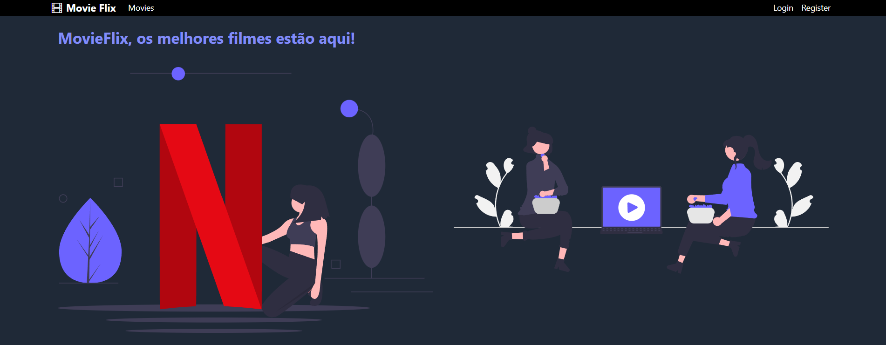
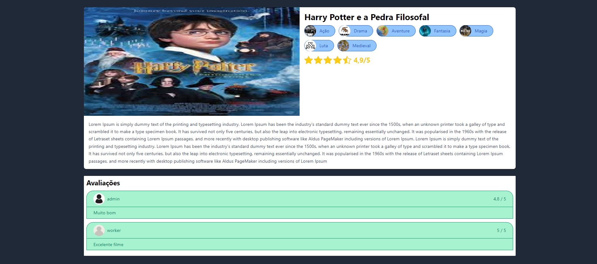
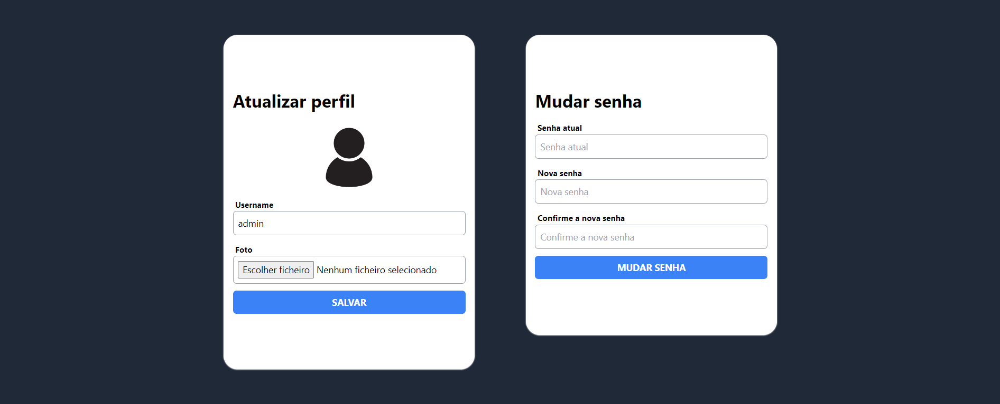
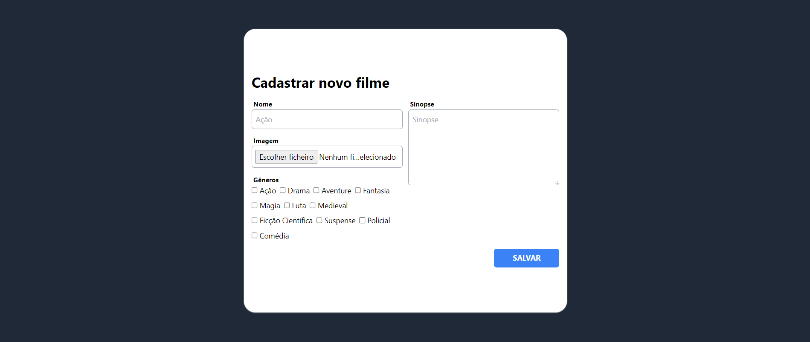
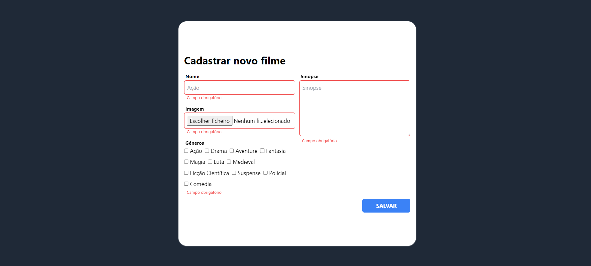
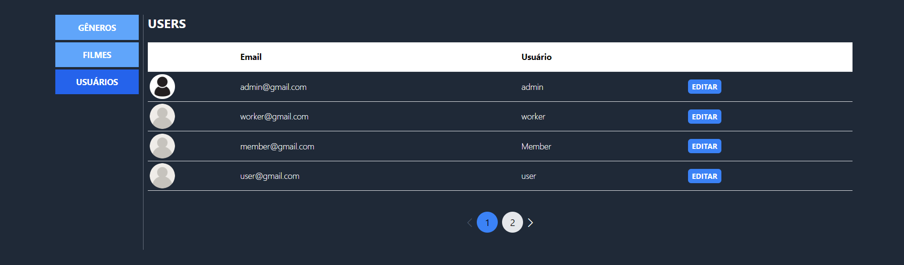
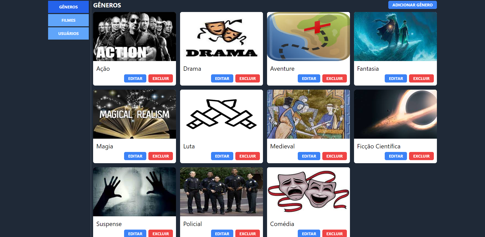

# MovieFlix Frontend React and TypeScript

## Requirements
* Node 18
* Npm 9.8
* Make sure you already setup the backend, following the instructions [here](https://github.com/Fronchak-Projects/MovieFlix-Backend)

## How to Use
1. Clone this project to your machine
2. Open your terminal in the project's folder
3. Run the following command: 'npm install' to install all the dependencies
4. In the 'Contantes.ts' file, localized in the 'src/utils' folder, verify that the 'BASE_API_URL' constant in setup accordingly to the backend url
5. Run 'npm run dev' to initialize the project
6. Open your browser in the 'http://localhost:5173' to see the home page

## Images

### Home page

### Register page

### Login page

### Movies page

### Movies details page

### Profile page

### Movie form

### Movie form validations

### Users list

### Genres

